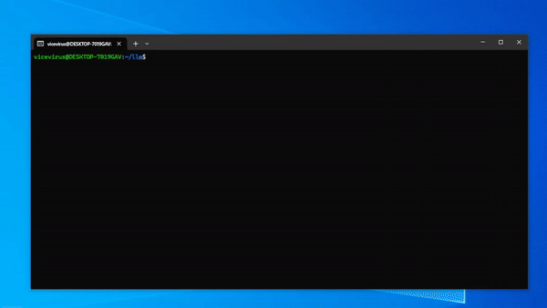

# LLM-Hayabusa-Logs-Parser

This is a simple script using [PandasAI](https://github.com/Sinaptik-AI/pandas-ai) that allows you to easily query your Hayabusa logs with LLM such as Gemini, OpenAI etc.

## Demo

## Note
This works better in GPT-4 in my experience.

